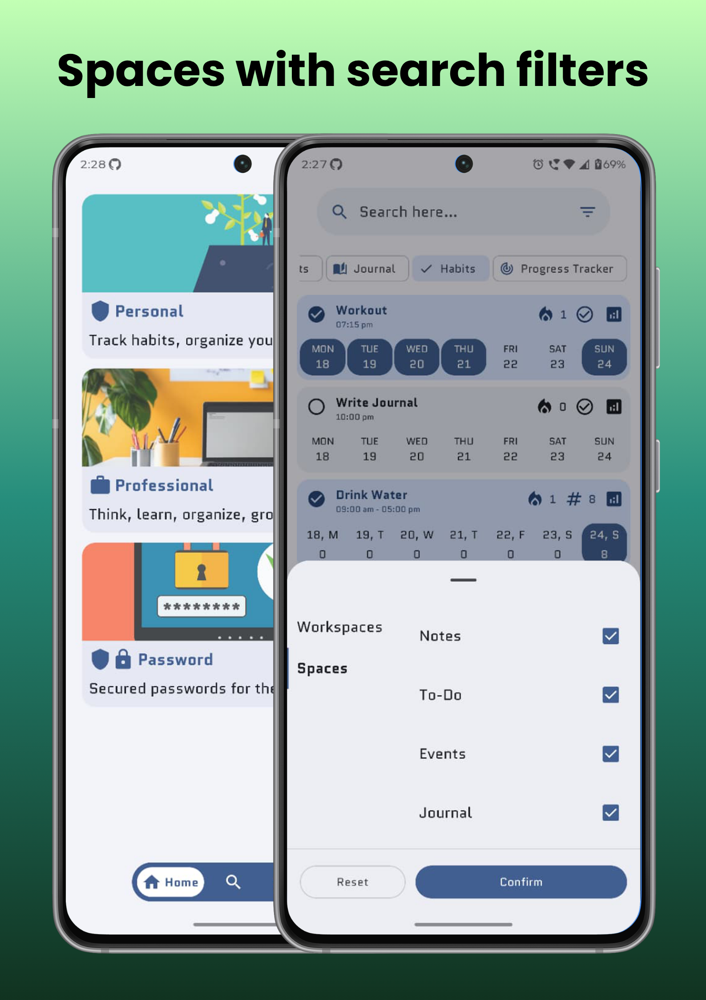
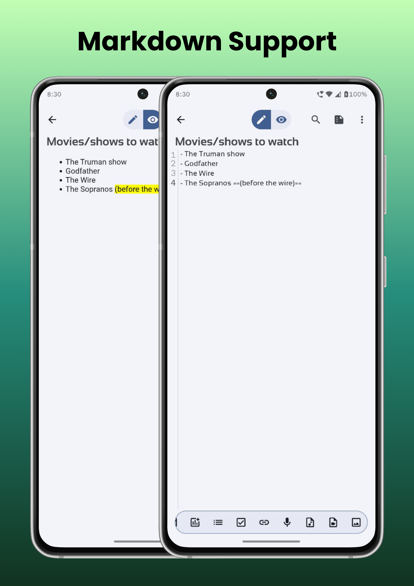
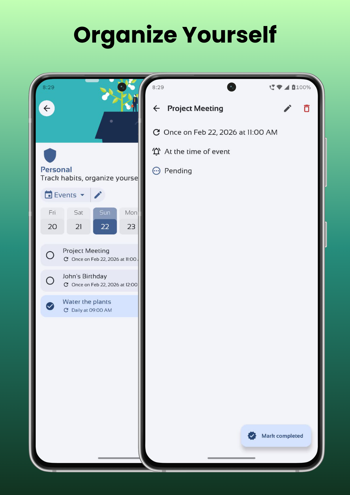
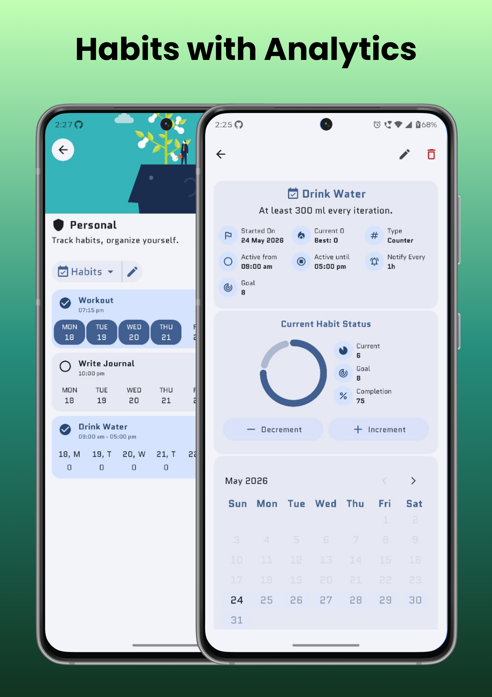
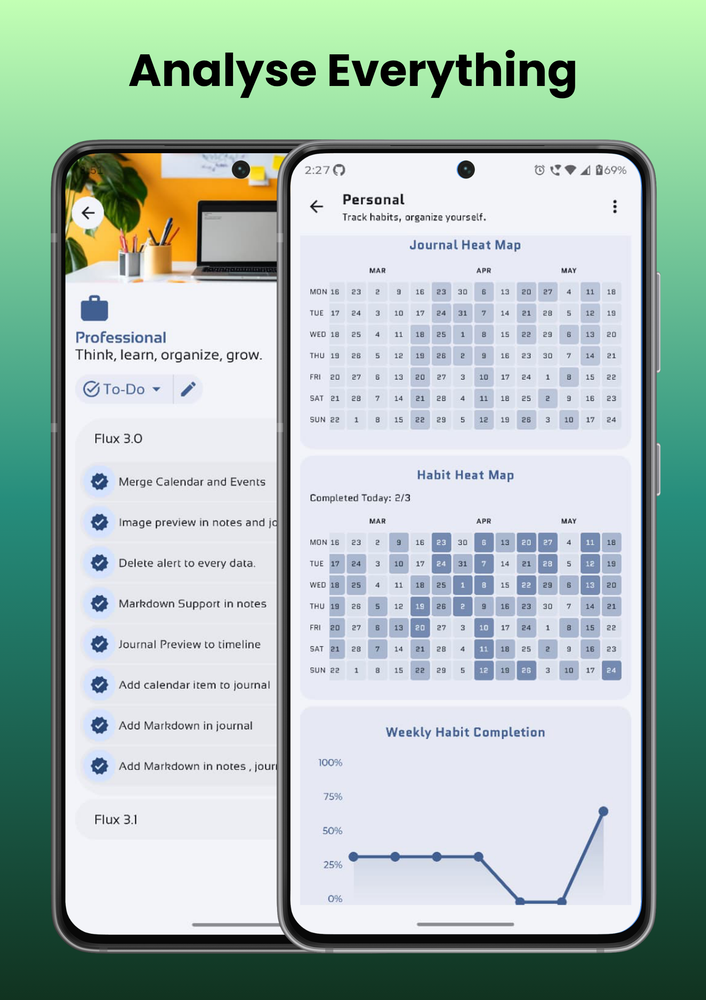
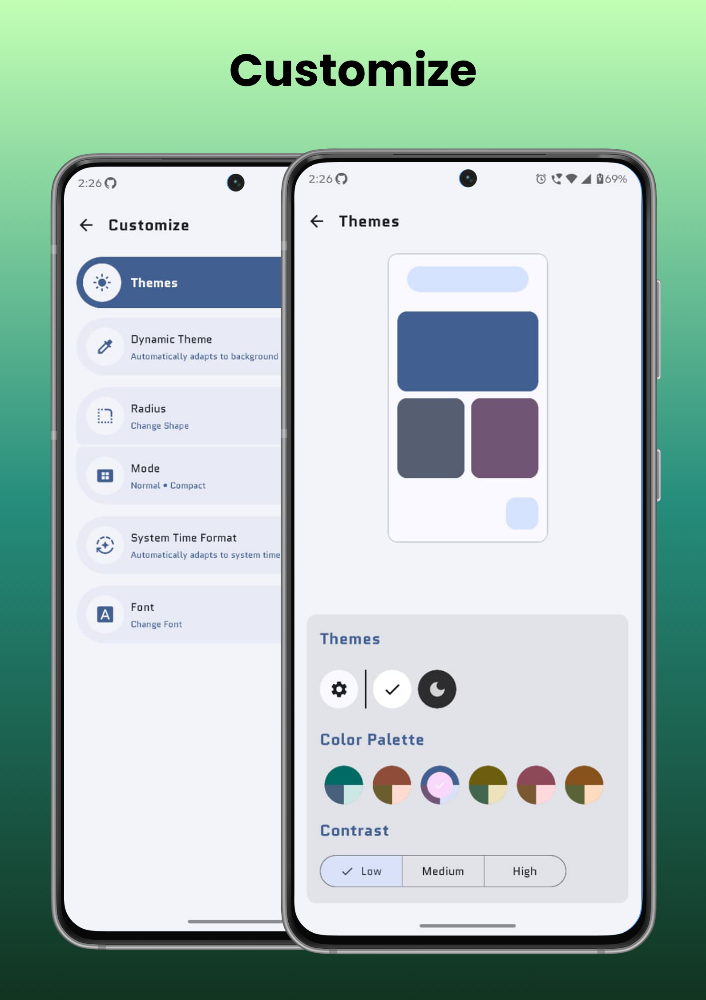

> [!CAUTION]
> ## [Keep Android Open](https://keepandroidopen.org/)
> ###  Your phone is about to stop being yours.
> Starting September 2026, a silent update, nonconsensually pushed by Google, will block every
> Android app whose developer hasn't registered with Google, signed their contract, paid up, and
> handed over government ID.
> **Every app and every device, worldwide, with no opt-out.**

<div align="center">
    
<br>

# Flux


**A lightweight Android productivity app built with Material 3.**

[](https://github.com/chindaronit/Flux/releases/)
[](https://f-droid.org/packages/com.flux/)
[](https://apt.izzysoft.de/fdroid/index/apk/com.flux)


---

</div>

|  |  |
| :----------------------------------------------------------------: | :----------------------------------------------------------------: |
|  |  |
|  |  |

---

<div align="center">

## Release numbers

[](https://github.com/chindaronit/Flux/releases)
[](https://github.com/chindaronit/Flux/blob/main/LICENSE)
[](https://github.com/chindaronit/Flux/releases)

</div>

## 🎉 Features

* ✨ **Modern Material You Design** built with Material 3 for a clean and intuitive experience.
* 🗂️ **Flexible Workspaces** with customizable templates to organize notes, tasks, journals, habits, and events according to your workflow.
* 📝 **Rich Markdown Editor** with support for formatting, code blocks, tables, LaTeX, Mermaid diagrams, and more.
* ✅ **Advanced Task Management** with recurring tasks, reminders, progress tracking, and completion analytics.
* 📔 **Daily Journals & Notes** designed for capturing ideas, reflections, and long-form content.
* 📅 **Integrated Calendar & Events** to manage schedules and important dates in one place.
* 🔥 **Habit Tracking & Analytics** with insights, statistics, and visual progress monitoring.
* 🖼️ **Media Support** for attaching images and organizing content alongside text.
* 🔒 **Privacy-Focused Security** with optional biometric app lock and screen protection.
* 📴 **Offline-First Architecture** powered by local storage for fast and reliable access.
* 🎨 **Highly Customizable Experience** with themes, workspace organization, and personalized layouts.
* 🌍 **Open Source & Community Driven** under GPL-3.0 with frequent updates and continuous improvements.
* 🚀 **Built with Jetpack Compose** for a fast, smooth, and native Android experience.

---

## 🌎 Translations

English, Hindi, French, Portugal (Brazil), Russian, German, Spanish, Dutch, Chinese (Simple)

## 🔎 Technical Details

- **Programming Languages**: Kotlin
- **Build Tool**: Gradle with Kotlin DSL
- **Android Version**: The application targets Android SDK version 36 and is compatible with devices
  running Android SDK version 29 and above.
- **Kotlin Version**: 2.4.0
- **Java Version**: JVM Target 11.

## 🛠️ Architecture

- **MVI**: Model View ViewModel
 
## 📦 Installation

To build and run this application, you need to install the latest version of Android Studio. Then,
you can clone this repository from GitHub and open it in Android Studio.

```bash
git clone git@github.com:chindaronit/Flux.git
```

In Android Studio, select `Run > Run 'app'` to start the application.

## 🎈 Contribution

Any form of contribution is welcome! If you find a bug or have a new feature request, please create
an issue. If you want to contribute code directly to this project, you can create a pull request.


## Credits

<div align="center">
<a href="https://github.com/chindaronit/Flux/graphs/contributors">

</a>

</div>

## ⚠️ License

```text
Flux

Copyright (c) 2025 Ronit Chinda

This program is free software: you can redistribute it and/or modify
it under the terms of the GNU General Public License as published by
the Free Software Foundation, either version 3 of the License, or
(at your option) any later version.

This program is distributed in the hope that it will be useful,
but WITHOUT ANY WARRANTY; without even the implied warranty of
MERCHANTABILITY or FITNESS FOR A PARTICULAR PURPOSE. See the
GNU General Public License for more details.

You should have received a copy of the GNU General Public License
along with this program. If not, see <https://www.gnu.org/licenses/>.
```

<div align="center">
   MADE IN INDIA
</div>
