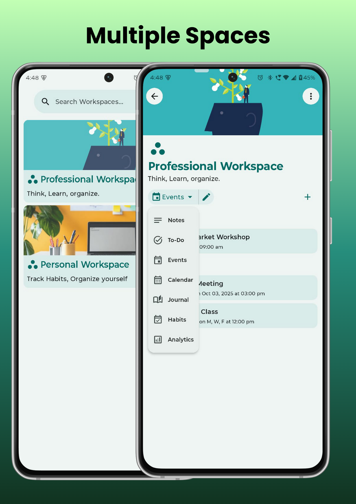
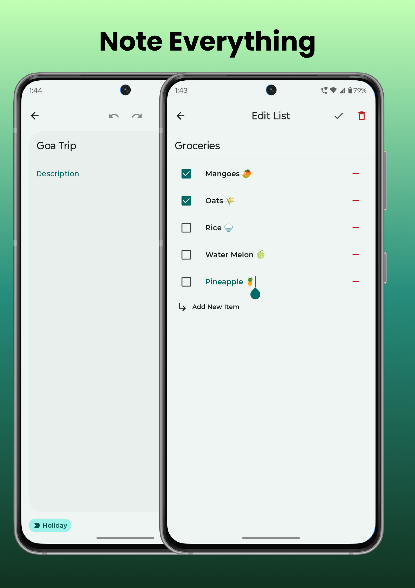
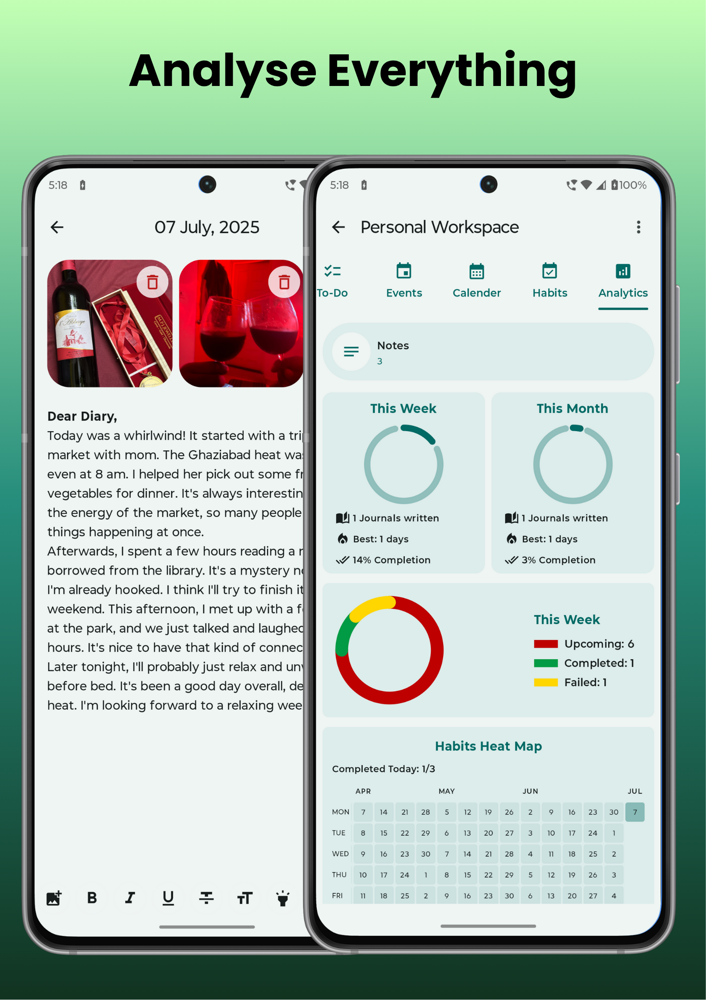

<div align="center">
    

<br>

# Flux


**A lightweight Android productivity app built with Material 3.**

[](https://github.com/chindaronit/Flux/releases/)
[](https://f-droid.org/packages/com.flux/)

---

</div>

|         |  |
|:---------------------------------------:|:-----------------------------------------:|
|  |       |
|       |         |
---

## 🎉 Features

- 📝 **Sleek, Minimalistic Design** with Material You (Material 3)
- 🌟 **Workspace Templates**: Organize tasks with custom workspaces
- 🔐 **Biometric App Lock** for privacy
- 🚀 **Frequent Updates & Improvements**

---

## 💬 Contact Me

- 📧 **Email:** ronitchinda100@gmail.com
- 📸 **Instagram:** [@chinda.ronit](https://www.instagram.com/chinda_ronit/)

---

## 🌎 Translations
English, Hindi, French, Portugal (Brazil), Russian, German, Spanish, Dutch

## 🔎 Technical Details
- **Programming Languages**: Kotlin
- **Build Tool**: Gradle with Kotlin DSL
- **Android Version**: The application targets Android SDK version 36 and is compatible with devices
  running Android SDK version 29 and above.
- **Kotlin Version**: 2.2.10.
- **Java Version**: JVM Target 11.

## 🛠️ Architecture
- **MVI**: Model View ViewModel

## 📚 Libraries and Frameworks

- **Compose**: A modern toolkit for building native Android UI.
- **Hilt**: A dependency injection library for Android.
- **KSP (Kotlin Symbol Processing API)**: Enhances Kotlin compilation with additional metadata
  processing.
- **Room**: A persistence library providing an abstraction layer over SQLite.
- **Compose Navigation**: Simplifies the implementation of navigation between screens.
- **Material Icons**: Provides Material Design icons for consistent visual elements.
- **CommonMark**: For markdown parsing and rendering.
- **Flexmark HTML to Markdown Converter**: Converts HTML to Markdown.

## 📦 Installation

To build and run this application, you need to install the latest version of Android Studio. Then,
you can clone this repository from GitHub and open it in Android Studio.

```bash
git clone git@github.com:chindaronit/Flux.git
```

In Android Studio, select `Run > Run 'app'` to start the application.

## 🎈 Contribution

Any form of contribution is welcome! If you find a bug or have a new feature request, please create
an issue. If you want to contribute code directly to this project, you can create a pull request.

## ⚠️ License

```text
Flux

Copyright (c) 2025 Ronit Chinda

This program is free software: you can redistribute it and/or modify
it under the terms of the GNU General Public License as published by
the Free Software Foundation, either version 3 of the License, or
(at your option) any later version.

This program is distributed in the hope that it will be useful,
but WITHOUT ANY WARRANTY; without even the implied warranty of
MERCHANTABILITY or FITNESS FOR A PARTICULAR PURPOSE. See the
GNU General Public License for more details.

You should have received a copy of the GNU General Public License
along with this program. If not, see <https://www.gnu.org/licenses/>.
